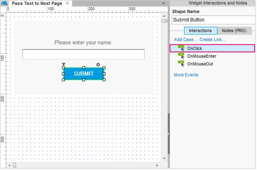
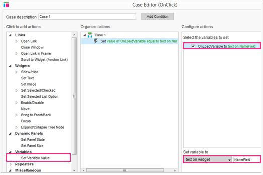
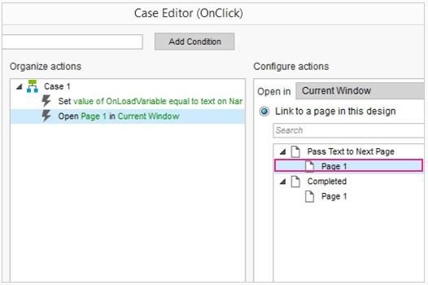
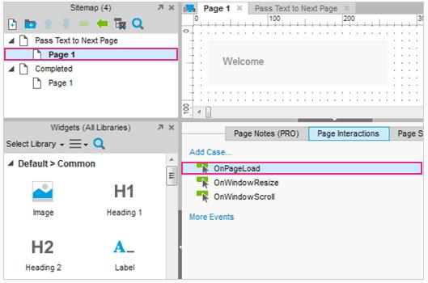
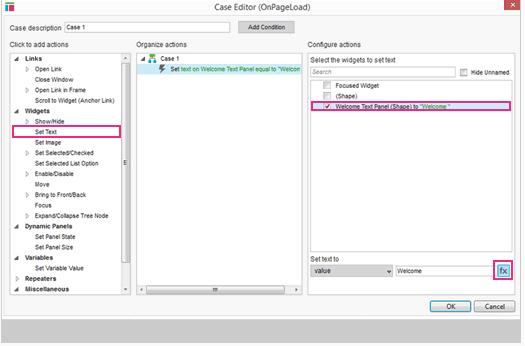
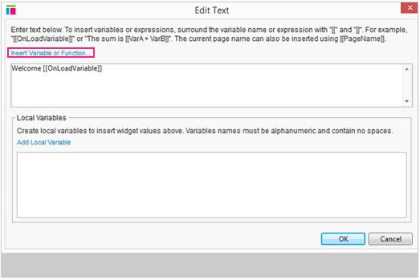
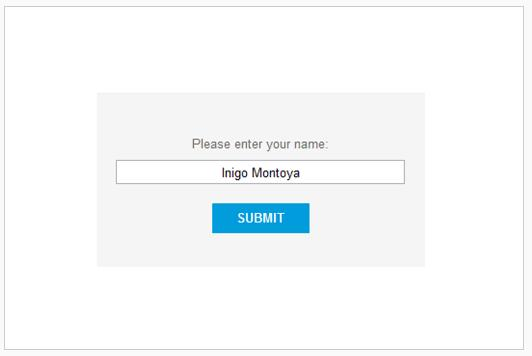

#变量：将文本传递给下一个页面教程

##把从页面输入的值传递到下一个页面
### 添加 OnClick 用例到提交按钮

首先，打开[AxurePassTextToNextPage.rp](downloads/AxurePassTextToNextPage.rp) 并打开“文本传递给下一个页面”页面。
在设计区域中选择提交按钮，并添加一个用例到 OnClick 事件。这将打开用例编辑器对话框。
### 把名称文本存储在一个变量中

在用例编辑器中，添加一个行动设置变量值，并选择 OnLoadVariable 。
在下拉列表中选择“文本小部件”，选择为名称。这将名称文本字段中输入的值存储在变量 OnLoadVariable 中。
### 添加动作打开第一张页面

继续留在原来的用例编辑器中，在现有的用例下添加一个行动到“开放链接”，并选择第1页。注意哦，这是很重要的，因为此动作需要这里设置的变量值——如果我们打开了第一页，变量值永远不会被设置。  
单击 OK，并关闭用例编辑器对话框。    
单击提交按钮将该变量设置为用户输入的任何文本字段，并打开第1页。
### 添加页面加载用例到第1页

接下来，从站点地图面板中打开第一个页面。在这里，我们想要插入存储在 OnLoadVariable 的文本值进入欢迎页面上的文本。
在底部的页面交互选项卡窗格中，添加一个用例到 OnPageLoad 事件。
### 在欢迎文本面板部件中设置文本

在用例编辑器中，添加一个“设置文本”的行动，并选择“欢迎文本面板”并单击“fx”按钮。
### 插入变量值到文本

在文本输入对话框中，将光标放到“欢迎”文本后面。点击“插入变量
或函数……”，选择 OnLoadVariable。 这将插入[[ OnLoadVariable ]]到文本中。无论存储在 OnLoadVariable 上的值是什么都将取代这个文本。    
单击OK，并关闭打开的对话框。
### 预览原型

预览您的原型和测试它。单击提交按钮设置变量的值，打开下一个页面，并插入值到欢迎文本。
##总结
你现在能传递文本到下一个页面了吗？  
还需要其他帮助吗？查看[论坛](http://www.axure.com/c/forum.php)或联系我们 **support@axure.com**
