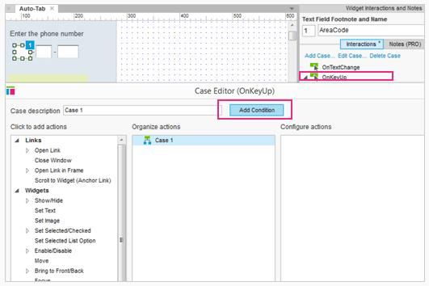
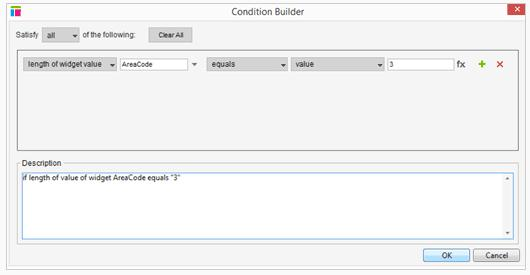
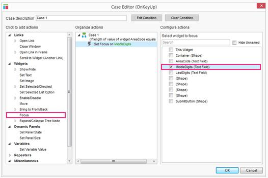
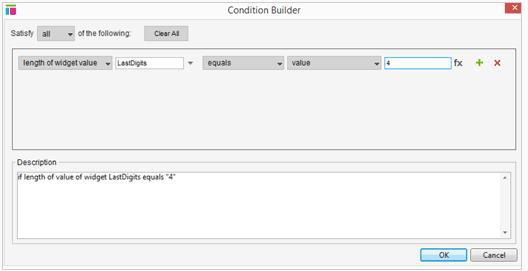
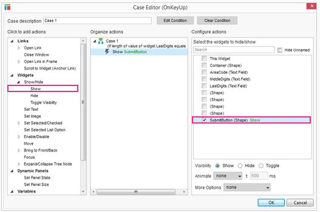

#条件逻辑: Auto-Tab 字段教程

##检测输入的字符数量
，
### 添加 OnKeyUp Case 

首先，打开[AxureAutoTab.rp](downloads/AxureAutoTab.rp)打开 Auto-Tab 页面。
选择第一个文本字段，添加一个 Case 到 OnKeyUp 事件。在 Case 编辑器中，单击“添加条件”打开条件生成器。

### 构建条件

在条件构建器，设置行为“AreaCode 中部件的长度值等于3”。  
单击 OK 并关闭条件生成器。

### 聚焦到下一个字段

在 Case 编辑器中选择 Focus，然后单击 MiddleDigits 的复选框。  

单击 OK 并关闭编辑器。

### 重复步骤设置中间的文本字段

重复步骤1到3设置中间的文本字段。而且为中间的文本字段设置同样的条件，并且把操作设置为聚焦到最后的文本字段。

### 为最后文本字段添加条件

在最后的文本字段，添加一个 OnKeyUp 事件，这一次把条件设为“最后的小部件的长度值等于4”。  
单击 OK，并关闭条件生成器。

### 添加 Show 操作

在 Case 编辑器中，选择“显示”行动并单击 SubmitButton 的复选框。
现在，当用户输入4位数在文本框中，隐藏的提交按钮将显示出来。

预览原型并测试它吧！
##总结
你的电话号码和社交保密文本永远都不相同的了。  
还需要其他帮助吗？查看[论坛](http://www.axure.com/c/forum.php)或联系我们 **support@axure.com**

