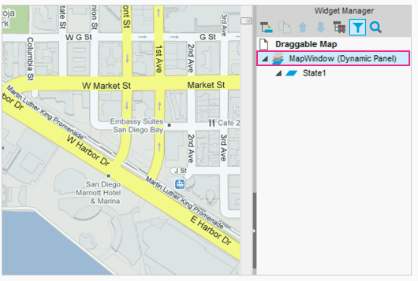
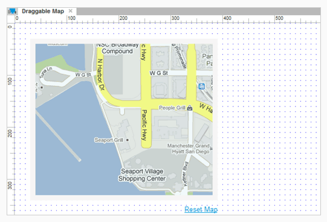
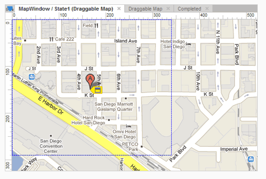
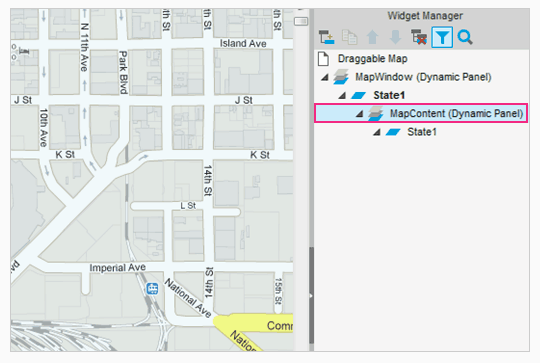
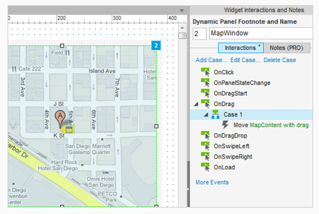

# 拖拽地图使用嵌套的动态面板和 OnDrag 

## 创建动态面板的 window 

首先打开[AxureDraggableMap.rp](/downloads/AxureDraggableMap.rp) 然后打开 Draggable Map。

因为我们不想让整个地图显示在显示屏上,我们将创建一个类似 window 的部件，这个部件给了我们一个可以查看部分地图的视图。要做到这一点,在设计区域选择谷歌地图,右键单击并选择转换为动态面板。

将其标记为 MapWindow。

## 调整 MapWindow 面板

接下来,重新定位 MapWindow 面板到灰色的长方形顶部。调整矩形内的面板,看起来像上边的图像。

## 重新定位地图面板内的状态

我们想要红色的地图图像中标记在地图的中间,让我们重新定位 MapWindow 面板内的地图状态。
 
打开 MapWindow 面板的 State1。复位地图位置，让红色的地图标记大概在动态面板的中间。部分地图可能会超出边框，但这没关系。

返回 Draggable Map 页面然后检查线框是否在你想要的地方。

## 将地图装换为动态面板

现在我们为地图创建一个窗口，让其可以被拖拽。为了做到这些，我们将地图装换为动态面板。再次打开 MapWindow 的 State1，右键单击图片然后选中 Convert to Dynamic Panel 选项创建另一个动态面板。

编辑这个面板为 MapContent。你现在会注意到这个面板嵌套在 MapWindow 中。

## 添加 drag 动作

在 MapWindow 面板中，添加一个事例到 OnDrag 事件中去。在动作菜单中，选中 Move 然后指定到 MapContent 面板。一般地，现在可以拖动面板了。点击 OK 关闭事例编辑器。

## 添加交互来重置地图

返回 Draggable Map 页面。选中 Reset Map 链接，然后通过动作 Move MapContent to (-530, -135) 添加一个 OnClick 事例，大概是原来的位置。

然后这就是原型了，测试它吧。
