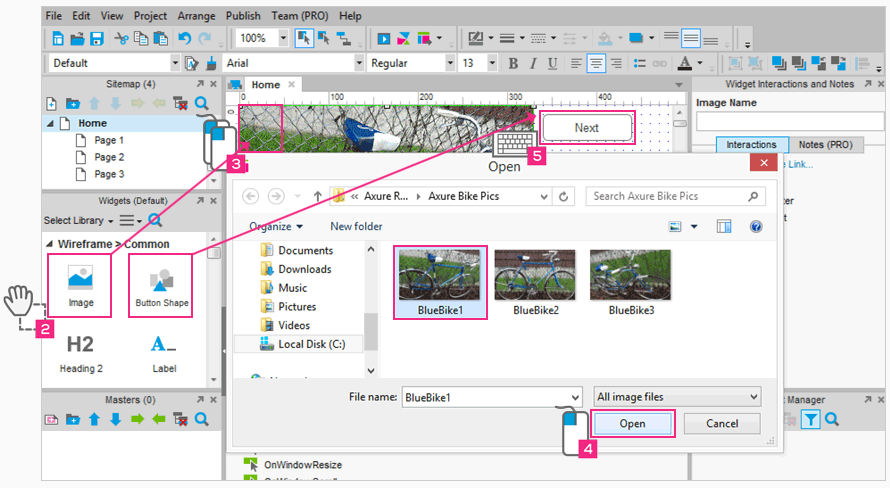
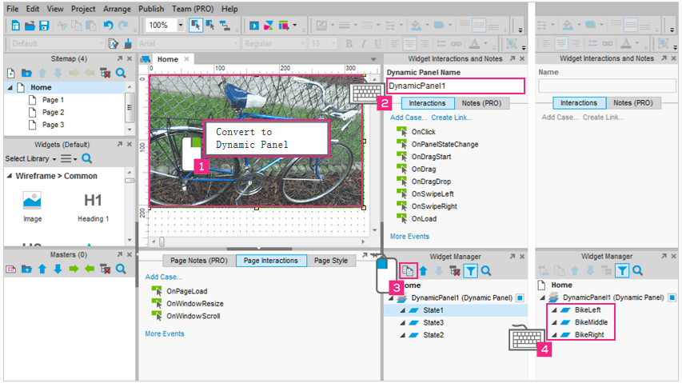
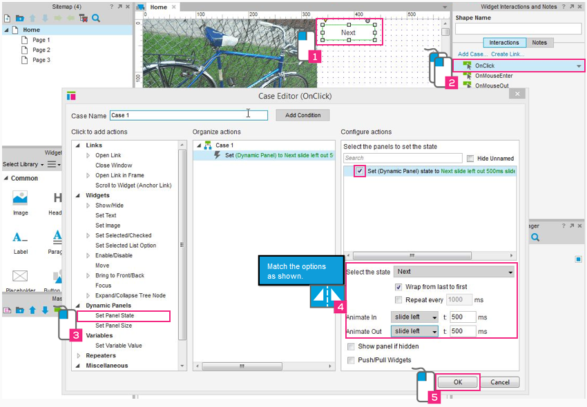

# 引入动态面板
使用“动态面板”创建一个简单的图像旋转。首先将图像小部件放置在每个面板的状态。然后，添加一个交互按钮形状使状态能够生动起来。

## 添加一张图片和一个按钮形状
[下载“AxureBikePics.zip”](downloads/AxureBikePics.zip)并解压缩文件夹的图片在你的计算机上。如果你喜欢你可以用自己的图像。

### 1 下载和解压
下载 AxureBikePics.zip 并解压文件夹到你的计算机上。
### 2  添加部件
拖放一个图像部件和一个按钮形状部件到设计区域如图所示。
### 3 选择图片
双击图像部件选择第一张图片 BlueBike1 。
### 4 点击打开
点击“打开”使用图片。  

当询问是否自动调整大小时，点击“是”。
### 5 在按钮上编辑文本
在按钮形状上编辑文本读作 Next。

## 转换到动态面板和添加状态

### 1 转换为动态面板
右键单击图像部件并选择“转换为动态面板”。
### 2 命名动态面板
命名新的动态面板为 DynamicPanel 。
### 3 复制第一个状态
在“部件管理器”窗口，选择 State1 并点击“复制状态”图标两次。
### 4 标注每个状态
轻轻双击标注三个状态 BikeLeft，BikeMiddle和 BikeRight。

## 为每一种状态添加一张图片

### 1 打开状态 BikeMiddle 
在“部件管理器”窗口双击“BikeMiddle”状态让它显示在设计区域。
### 2 输入图像
双击图像部件导入第二张图像。
### 3 点击打开
点击“打开”使用图片。  

当询问是否自动调整大小时，点击“是”。
### 4 对 BikeRight 重复上述步骤
重复步骤1-3将第三张图片放到 BikeRight 状态。

##  通过点击 Next 在面板显示下一个状态

### 1 选择 Next 按钮
在主页上选择“Next”按钮形状部件。
### 2 添加一个 Case 到 OnClick 
双击 OnClick 事件为按钮形状添加一个案件。
### 3 添加动作
在最左边列表选择动作“设置面板状态”。
### 4 指定面板和选项
选择 DynamicPanel 和如图所示为动作匹配选项。
### 5 点击 OK 
点击 OK 按钮添加动作

## 预览原型
预览你的原型。单击 Next 按钮推动图像。当你到达第三张图片时它将绕回第一张图片。
