# 设计一个可以在 iPhone 或者 Android 上展示的原型

## 介绍

这个手机指南将指导你完成一个可以在 iPhone 或者 Android 设备上展示的原型。当我们完成后你将会知道怎么设计和生成一个可交互的手机网页原型。

## 让我们开始吧

首先，打开[AxureMobileWeb.zip](/downloads/AxureMobileWeb.zip) 并解压到你电脑的一个新目录中。然后，启动 Axure RP 并保存一个新的文件，命名为 MobileWeb.rp。（使用 File > Save As）。

## 设置手机浏览的文件

### 新建辅助线

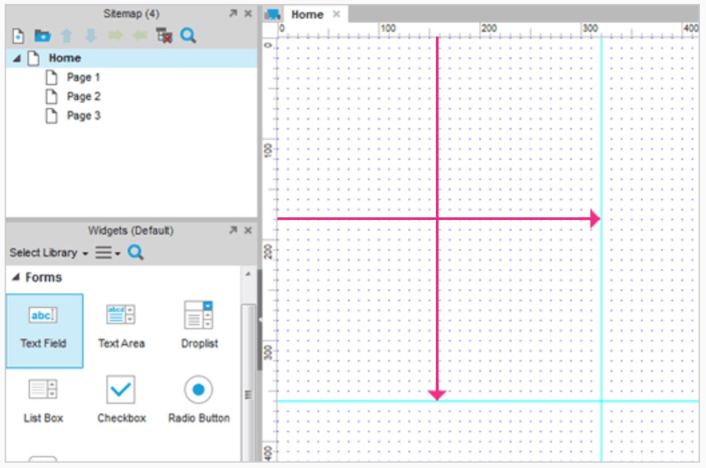

在开始之前，先为我们正在设计的屏幕大小创建辅助线。在 iPhone 和 Android 中，很典型的使用宽度是 320。在这个例子中，当导航栏可见的时候，我们将在 iPhone 可见区域的 360 高度处设立一条辅助线。

点击和拖动标尺位置到设计区域就可以添加辅助线。

### 添加 viewport tag

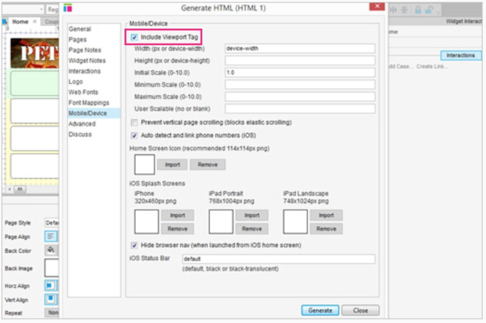

我们也需要在原型中设置 viewport tag，这样手机浏览器就知道怎么缩放页面。

打开 Generate HTML 窗口，选择 Mobile/Device 和勾选 Include Viewport Tag。保留默认设置然后点击 Generate 查看生成的原型。

### 在 Sitemap 外查看原型

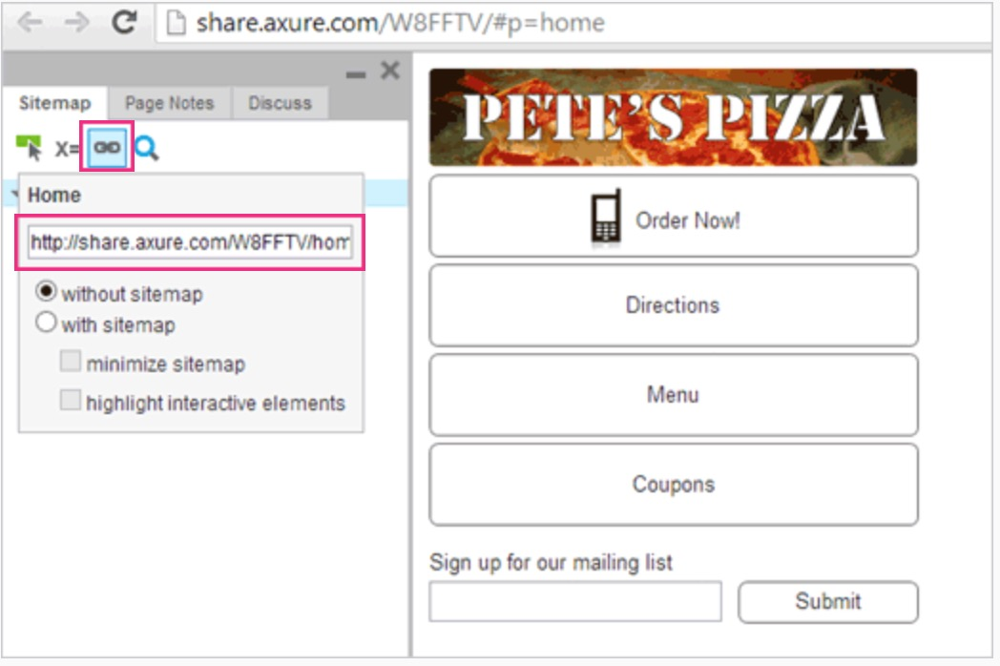

想要在你的 iPhone 或者 Android 手机上查看原型，需要将原型文件发布成一个 web server。一个很简单的发布原型的方法就是上传 rp 文件到 share.axure.com (upload the rp file to AxShare).

在手机上查看的时候，不想 sitemap 显示或者想 viewport tag 中设置的视图不生效，这时候我们可以打开这个原型然后点击 Show Links 获取不显示 sitemap 的原型 URL。

### 手机上查看原型

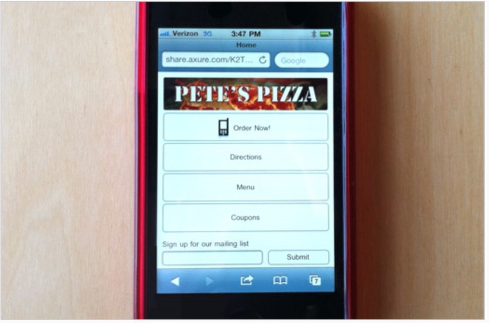

将不显示 sitemap 的原型 URL 发送到自己邮箱。

在你手机的邮箱中打开链接。在手机中不需要播放器或者 App，只需要浏览器。

**这时候你的原型是空的。**当你构建原型的时候，你可以上传你的 RP 文件到相同的链接中，然后刷新浏览器就可以看到改变的内容。

## 导航

### 添加 logo 和 导航按钮

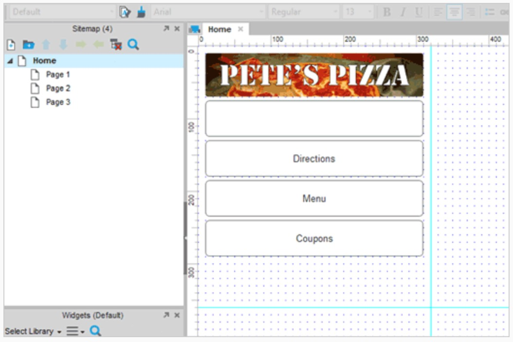

首先，添加一个 image widget，然后导入解压文件里 images 目录下的 logo.png。把它放置在设计区域的顶部，并设置距离四周 10px。然后添加 4 个 300 x 50px 的 button shape widgets。

删除最上方按钮的文字，然后把剩下的 3 个按钮文字分别设置成Directions，Menu，Coupons。

### 创建有图标的按钮

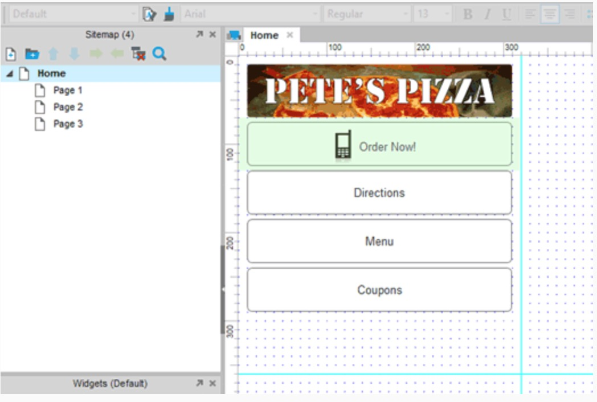

拖动一个 image widget 和 text panel 到顶部按钮的上层。双击 image 并导入压缩文件里的 cell.gif。在 text panel 里面输入 Order Now ！

然后，在整个按钮上设置一个热点。

### 添加拨打电话的链接

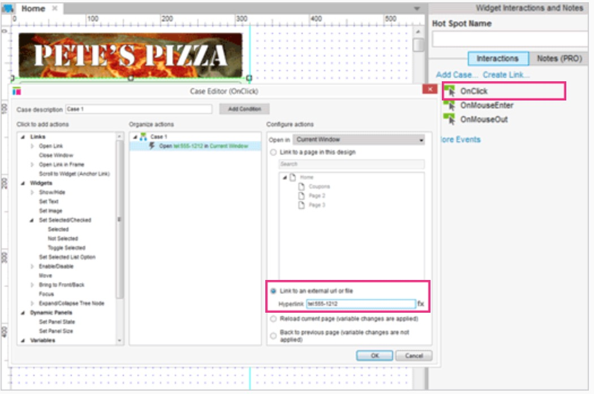

选择热点和双击 OnClick。选择 Open Link 操作然后选择 Link to an External Link or File 并在文本框中输入 tel：555-1212.

先产生原型然后尝试在手机上查看。点击 Order Now 按钮将会出现一个窗口来拨打刚才输入的号码。

### 給弹窗添加动态面板

接下来我们将添加显示 directions 和 menu 的动态面板。拉伸面板覆盖掉 Directions 及它以下的部分，保留 logo 和 order now 可见。

将 dynamic panel 命名为 PopupStates。添加除了 State1 之外的两个或两个以上的 states，总共三个 states。命名这三个 states 为：Directions，Menu 和 None。

我们下一步将制作单独的 Coupons 页面。

### 设置面板隐藏和放置在后一层

现在我们可以在 style tab 中选中 Hidden 让这个面板隐藏。

为了更简单选中按钮，我们可以右键点击面板并选择[Order > Send to Back]。

### 添加展示面板的 Onclick Case

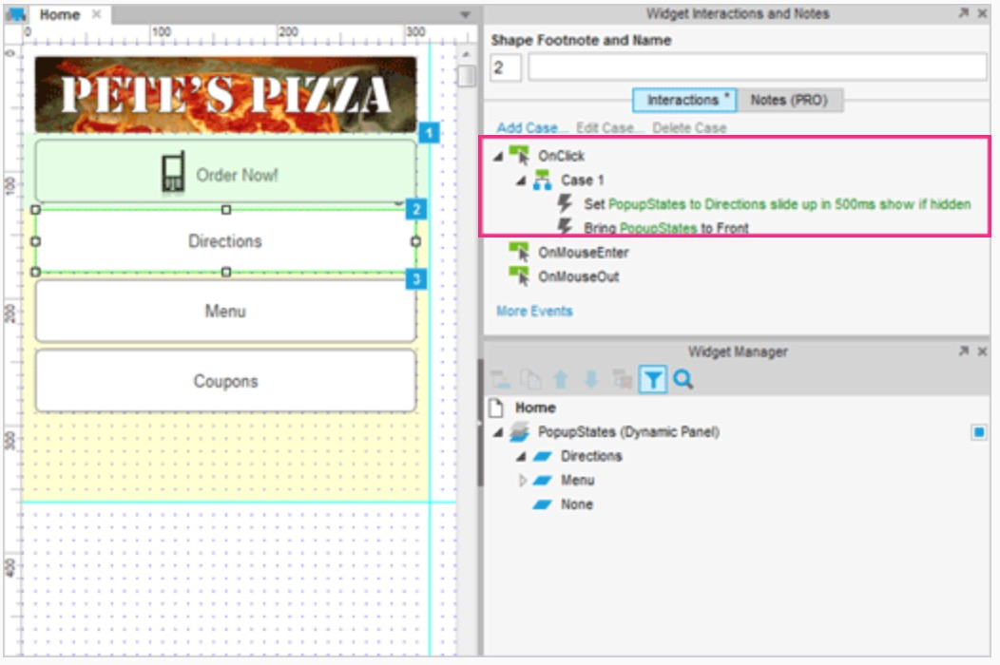

现在我们要給 Directions 和 Menu 设置点击交互事件来让我们的 PopupStates 面板展示相应的状态。

在 Directions 按钮上，添加一个 OnClick 事件通过滑动动画让 PopupStates 面板转换到 Directions 状态。勾选 Show panel if hidden。

重复此步骤设置 Menu 按钮和状态。

## 弹出窗口

### 新建弹出窗口 & 关闭按钮

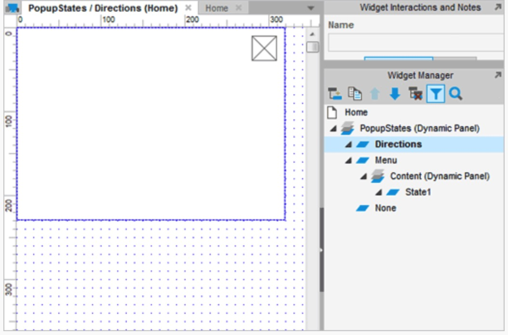

现在我们准备分别給 Directions 和 Menu 状态添加一个背景和按钮用来点击的时候隐藏面板。双击 Directions state 启动编辑。添加一个 rectangle 并拉伸它覆盖整个 state。

在右上角处添加一个 30x30px 的 placeholder 控件。

### 添加隐藏窗口的交互

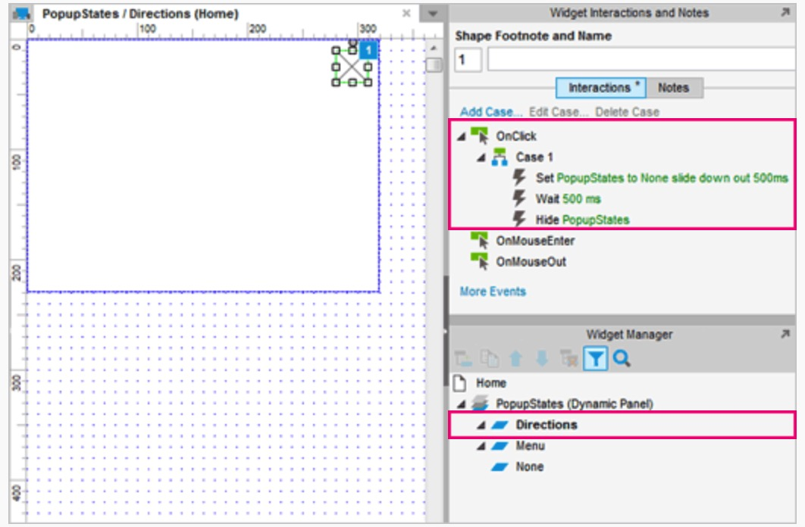

选中 placeholder，并添加一个 Onclick 事件。在 case 编辑器中，添加 Set Panel State 操作，让 PopupStates 的状态伴随向下滑动动画变成 None。添加 Wait 操作为 500ms。最后，使用隐藏操作并选择 PopupStates 面板来隐藏此面板。

### 复制／粘贴窗口控件到 Menu state 中

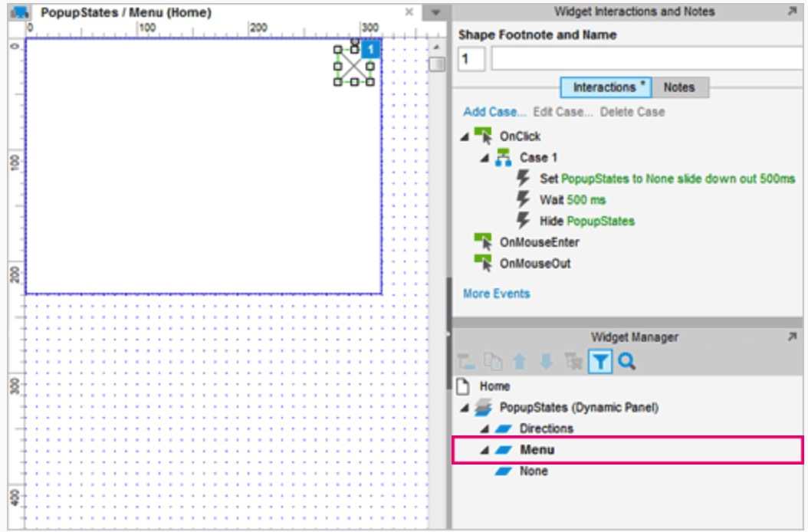

将 Directions state 中的背景和按钮复制粘贴到 Menu state 中。

或者，你可以重复之前的两步来设置 Menu state。

**提示：** 右上角的 placeholder 的 Onclick 交互同样可以在 Directions state 中 复制粘贴到 Menu state。

## 外部链接到 Google Maps

### 新建 Directions state w/map & text

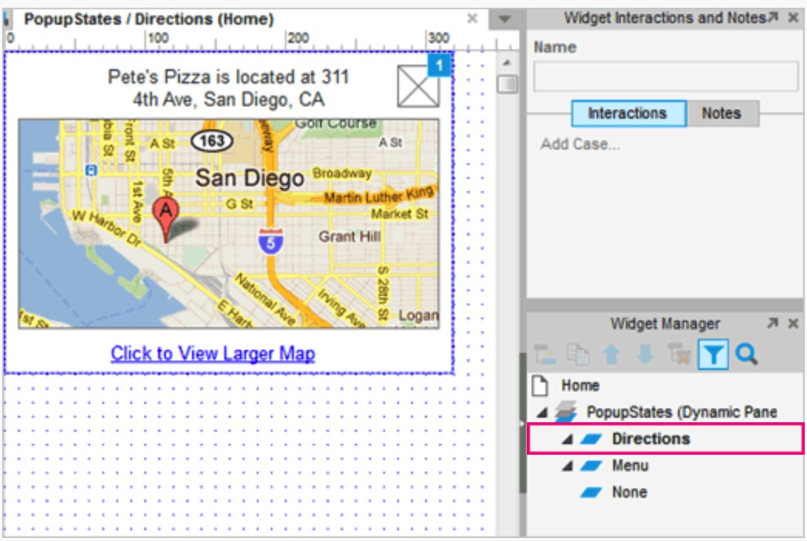

打开 Directions state 并添加一个 image widget 在 rectangle 上方。双击这个 image 并导入压缩文件里面的 map.png。

在地图的上方，添加一个文本并写上"Pete's Pizza is located at 311 4th Ave,
San Diego, CA”。

在地图下方，添加一个 Label 并写上"Click to View Larger Map"。

### 从 Google Maps 获取链接

现在我们准备从 Google Maps 获取链接用来在手机上启动 Google Maps 应用。

打开 maps.google.com 和搜索地址。在右上方，点击 link 图标然后拷贝 link URL。

### 添加 link 为 Google Maps 的链接

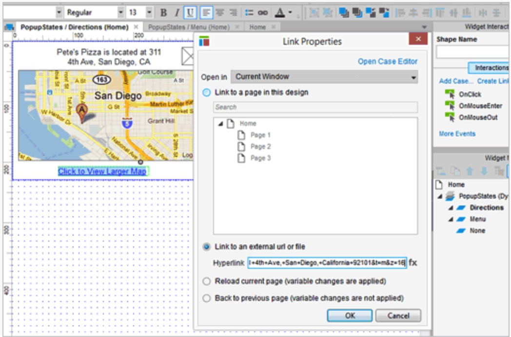

双击 Click to View Larger Map，并选择 hyperlink 图标来打开 link dialog。将 link 粘贴到 Link to external url 区域然后点击 OK。

生成原型然后在手机上查看。

## 滚动内容

### 添加填充文本，转变成动态面板

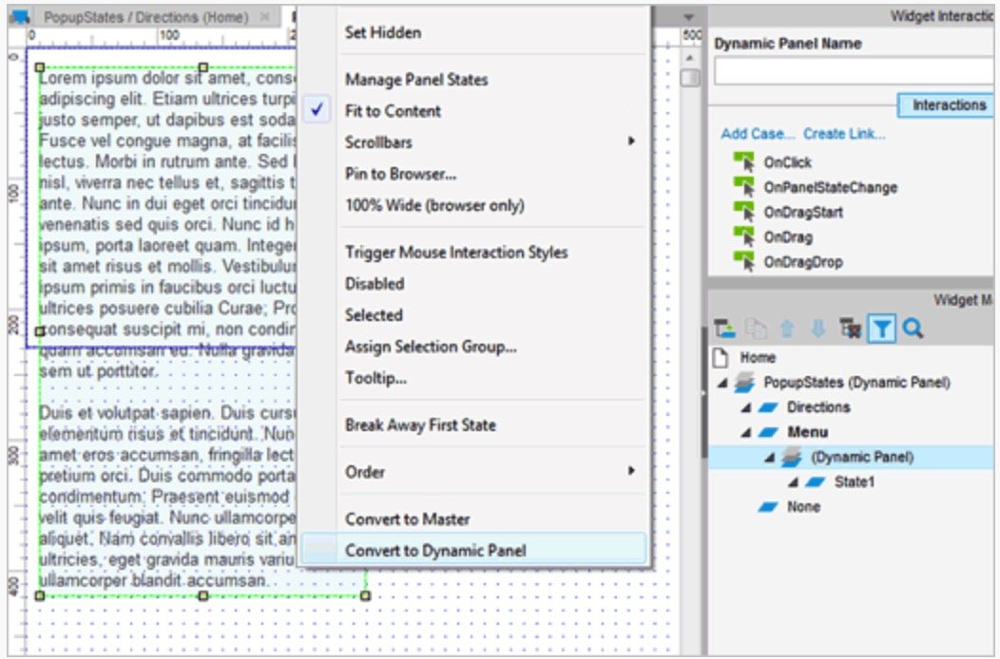

现在我们准备給 Menu state 添加滚动内容。

打开 Menu state 并添加一个 Paragraph 控件。复制粘贴整个段落到这个控件中，之后这个控件中就有两个段落。调整宽度适配这个 state。

右键点击然后通过选择[Convert to Dynamic Panel]将文本转换成动态面板。将这个面板命名为 Content。

### 调整并添加垂直滚动条

调整动态面板的底部让它适应 rectangle 的内部，像上面截图看到的那样。

选择动态面板并在 Properties 面板的 Scrollbars 下拉列表中选择 Vertical as Need。

**注意：**在一些老的手机浏览器中这样的滚动方法可能不生效，但在多数先进设备上是正常使用的。

### 设置 Coupons 页面

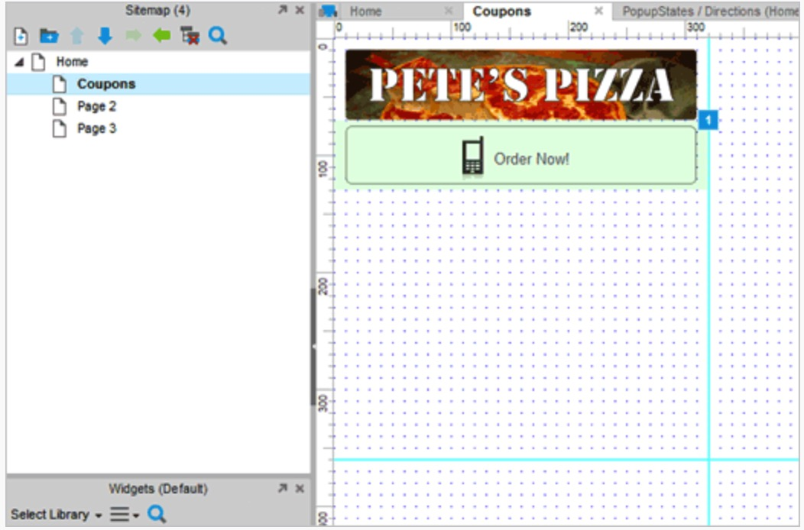

主页面设计是适应手机屏幕不需要滚动的。但是 Coupons 不同，我们需要链接一个比屏幕更高的新界面让它在手机浏览器中可以滚动。

将 Page 1 重新命名为 Coupons。打开这个页面然后在 320 宽度和 360 高度处添加辅助线。

**提示：**如果我们已经添加全局辅助线（从标尺拖动辅助线的时候按住 Ctrl 或者 Cmd ），这个辅助线将会出现在每个页面中。

复制 logo 和 Order Now 按钮到 Home page。

### 添加 Coupons

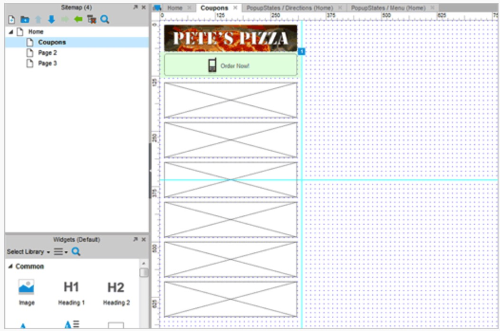

在 Order Now 按钮的下方添加几个 placeholder 控件这样它们就可以在 360px 辅助线的上方正常工作。

在主页面，使用 Create Link 来給 Coupons 按钮链接 Coupons 页面。

生成原型然后试一下。你将可以让 coupons 页面滚上滚下。

## "JOIN MAILING LIST" 域

### 添加 email 域和提交按钮

在主页面的底部，添加一个文本域然后在它右边添加一个按钮。删除文本里面的文字，并将按钮的文字设置成 Submit。

在文本域的上方，添加一个文本面板。更改文字为 Join our mailing list。

在控件配置面板上，标注文本面板为 EmailPanel 并将文本设置成 EmailField。

### 給 Submit 按钮添加交互事件

接下来选择 Submit 按钮并为它添加一个 OnClick 事件。在 Case 编辑器中，选择 “Set Text”，选中 EmailField 控件。

首先，我们将清空文本域里面的文字。为此我们保留值域空白。

添加第二个 Set Text 操作，并选择 EmailPanel。选择编辑文本按钮，将当前文本高亮显示，并替换它的值为 "Thank you for signing up"。

去尝试吧，这应该能在你的手机浏览器中正常工作。
