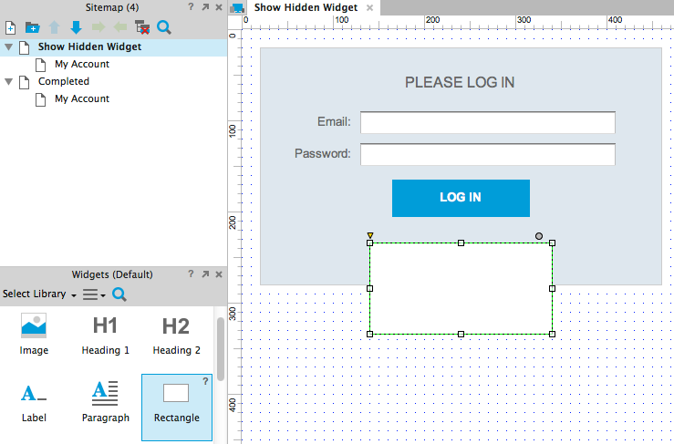
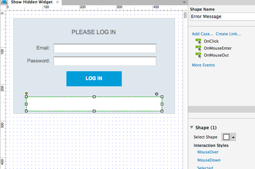
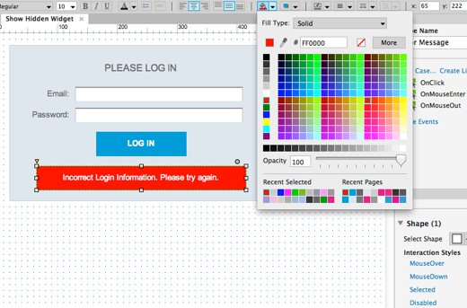
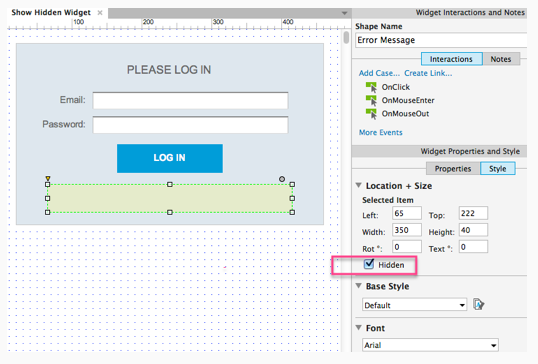
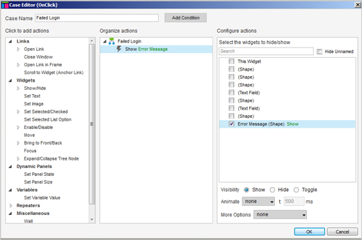

# 显示隐藏部件

## 添加矩形部件

首先打开 AxureShowHiddenWidget.rp 然后打开 Show Hidden Widget 页面。

在这个例子中，我们将创建一个错误信息来显示登陆失败。

从 Widgets 面板拖动一个矩形部件到设计区域，让其在 Login 按钮下面。

## 命名部件

当矩形被选中时这么做：

在部件的顶部输入新的名字 Error Message 。

## 设计错误信息

使用格式工具来创建一个装载着白字字的红色盒子，用于显示你的错误信息，信息如下：

Incorrect Login Information. Please try again.

## 隐藏部件

选中矩形，在 Style 选项板中选中 visible 选项。在默认情况下这隐藏页面上的小部件,你会看到一个黄色的东西。

## 为 Successful Login 添加事例

现在添加一个交互到 Log In 按钮上。第一个事例是，如果登陆成功打开 My Account 页面。
 
在设计区域选中 Log 按钮。添加一个事例到 OnClick 事件，然后在事例编辑器中改变事例的名字为 Successful Login 。接着添加一个 Open Link 动作然后选中 My Account 页面。
 
点击 OK 关闭事例编辑器。

## 为 Failed Login 添加事例

第二个事例，如果登陆失败，让其显示一个错误。
 
添加第二个事例到 OnClick 事件，并起名为 Failed Login 。接着添加动作 Show ，选中 Error Message ，点 OK 。

## 预览原型

点击工具栏的预览按钮来预览原型。你将看见当你点击 Login 按钮时会出现两个按钮。点击 Successful Login 会进入 My Account 页面，而点击 Failed Login 会显示错误信息。
