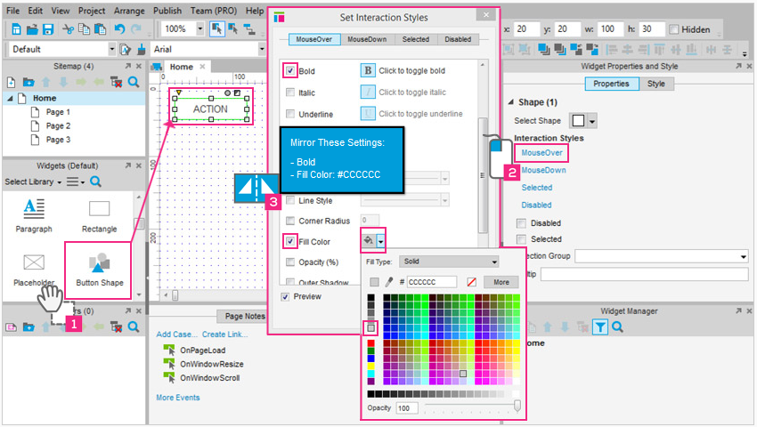
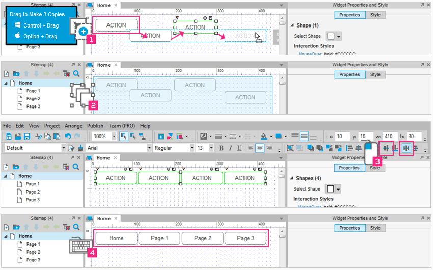
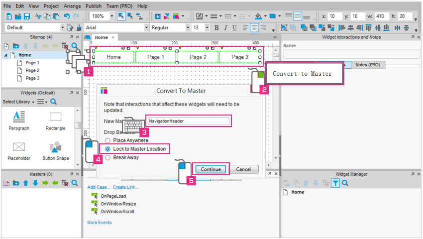
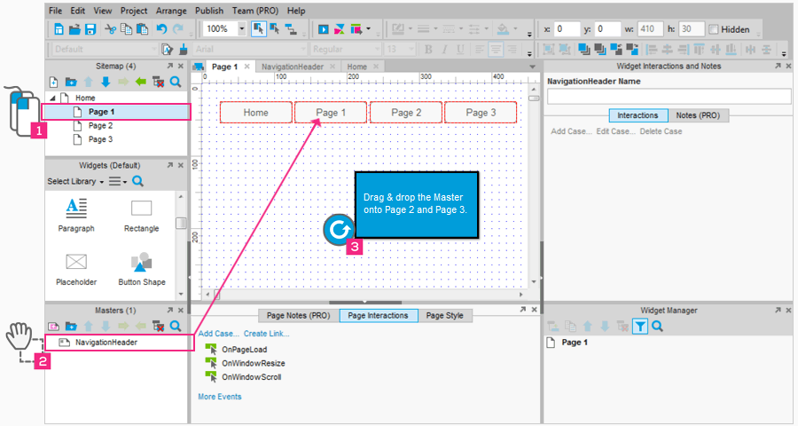
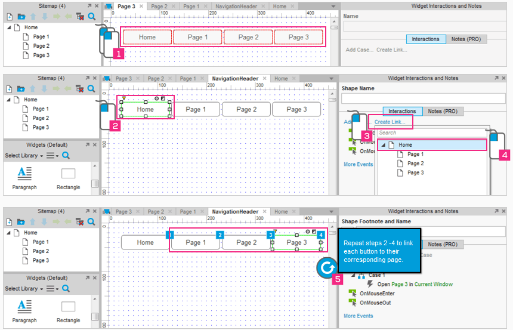

# 部件库和 Masters

添加，编辑和设计小部件。然后，把它们（部件）转换到一个 Master， 这样你就能集中管理和重用整个设计。

## 添加一个 Button shape 和设置 MOUSEOVER 风格

### 1 添加一个 Button shape 
拖动部件库窗口的 Button shape 并将它放在设计区域。

### 2 打开交互风格对话框
从“部件属性和风格”选项卡中的“属性”选项卡选择 MouseOver。

### 3 勾选粗体和设置填充颜色
勾选“粗体”和“填充颜色”选项。然后选择灰色填充颜色。最后，点击“OK”。

## 复制并放置 Button shape 

### 1 拖住复制

按住 [Ctrl] 键并拖动复制部件。如果你是使用 Mac 系统，则按住 [Option] 键。  

重复上面动作三遍，这样你就能得到四个完全一样的部件。

### 2 选择部件
通过左键单击设计区域选择所有部件，然后按住鼠标拖动所有部件。

### 3 对齐与分布
选中所有部件，点击“中心对齐”，然后在工具栏里选择“水平均匀分布”。

### 4 在 Button shape 上编辑文本
选择，然后如图所示给每个按钮命名。按钮的名字应该匹配 Sitemap 中的页面。

## 将 Button shape 转移到 Master

### 1 选择 Button shape 
单击拖动选择所有（四个）按钮。

### 2 转换为 Master
选择四个按钮右键单击然后选择 Convert to Master 选项。

### 3 命名 Master
将 Masters 命名为 Navigation Header。

### 4 选择行为
选择单选按钮 Lock to Master Location 选项。

### 5 点击继续
点击“继续”按钮创建你的 Master 。

## 把 Masters 放到每个页面上

### 1 打开页面 1 
双击 Sitemap 中的“页面 1”在设计区域打开它。

### 2 拖 Master 到页面上
从 Masters 窗口拖动 Master 到“页面 1”的设计区域上。

### 3 重复
重复动作打开“页面 1 ”和“页面 2”，并将 Master 放到各自的页面上。

## 在 Master 上给每个 Button shape 添加链接

### 1 双击打开 Master 
双击打开 Navigation Header Master。

### 2 选择主页按钮
在Master上选择“主页”按钮。

### 3 点击创建链接
点击“交互”选项卡上的“创建链接”。

### 4 选择主页
在下拉表框中选择“主页”页面。

### 5 重复动作
每个按钮重复2-4的步骤，各自链接到其相应的页面。

## 预览原型
预览你的原型。移动你的鼠标经过按钮看到 MouseOver 风格和点击它们作为页面导航。注意在 Master 上添加一次链接将会应用到所有网页上。